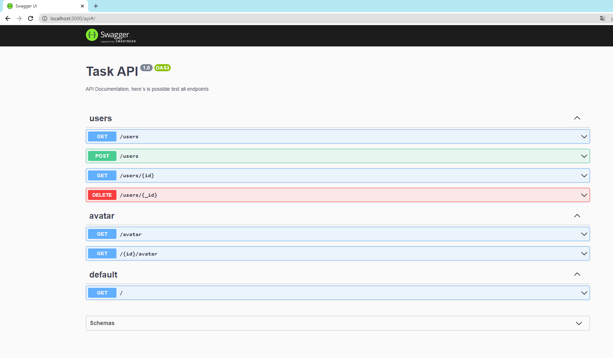

# BackEnd task

This project consists of a simple REST application, created from scratch using the NestJS framework. The application is responsible for communicating with the nodeJS server API available at https://reqres.in/, implementing four endpoints:

- POST /api/users
- GET /api/user/{userId}
- GET /api/user/{userId}/avatar
- DELETE /api/user/{userId}/avatar

## API documentation

#### Returns all items created from Database

```http
  GET / http://localhost:3000/users
```

#### Returns an avatar link by id from reqres API

```http
  GET / http://localhost:3000/{id}/avatar
```

| Parâmetro | Tipo     | Descrição                                  |
| :-------- | :------- | :----------------------------------------- |
| `id`      | `number` | **Mandatory**. The ID of the item you want |

#### Returns an user by id from reqres API

```http
  GET / http://localhost:3000/users/{id}
```

| Parâmetro | Tipo     | Descrição                                  |
| :-------- | :------- | :----------------------------------------- |
| `id`      | `number` | **Mandatory**. The ID of the item you want |

#### Create User

```http
  POST /  http://localhost:3000/users
```

| Parâmetro | Tipo              | Descrição             |
| :-------- | :---------------- | :-------------------- |
| `object`  | `number & string` | **Mandatory** object. |

#### the object must contain the name and profession, like below

```
{
    "name": "Theo Vieira",
    "job": "guitar player"
}

```

#### Delete User

```http
  DELETE /  http://localhost:3000/users/{_id}
```

| Parâmetro | Tipo     | Descrição                       |
| :-------- | :------- | :------------------------------ |
| `_id`     | `string` | **Mandatory** and must be \_id. |

## Enviroments

To run this project, you need to add the following environment variables in your .env file:

| variables      | description                                  |
| -------------- | -------------------------------------------- |
| `MONGO_URL`    | The MongoDB connection string.               |
| `RABBITMQ_URL` | The RabbitMQ connection string.              |
| `PASS`         | The password used to authenticate with SMTP. |

## Instructions to create the password at link:

```
https://stackoverflow.com/questions/45478293/username-and-password-not-accepted-when-using-nodemailer )
```

## Prerequisites

To run this project, you need to have the following software installed:

- Node.js version 18.15.0
- NestJS version 9.0.0

## running locally

Clone the project

```bash
  git clone https://github.com/henriquecvieira/api-task-latam.git
```

install the dependencies

```bash
  npm install
```

start the server

```bash
  npm run start
```

## Important to notice:

to verify theendpoints on swagger, go to link below.
but certify you start the application first

<http://localhost:3000/api>



## 🔗 Links

[](https://www.linkedin.com/in/henriquecarvalhovieira/)
